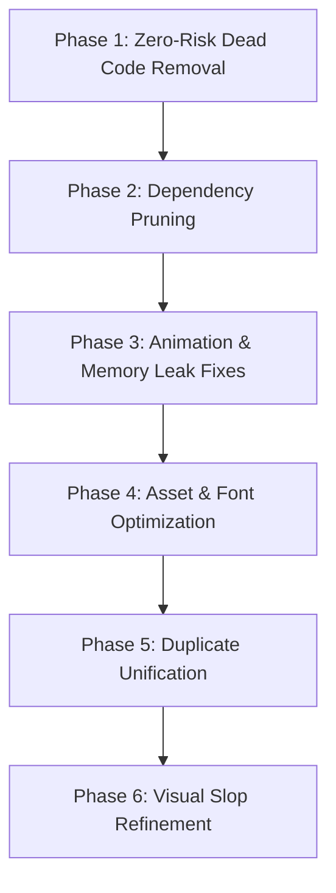

# NEXUS Frontend Comprehensive Cleanup Audit

> **Audit Status**: Baseline Established  
> **Rule Enforcement**: Non-Destructive Audit Only — Zero application source code modified during this audit.  
> **Date**: September 2026  
> **Target Systems**: Main NEXUS Web Application (`frontend/`), E-ID Card Application (`frontend/src/eid/` & `Eid-card/ui/`), Shared Utilities, Assets, and Tooling.

---

## 1. Executive Summary & Inventory

The NEXUS frontend comprises two intertwined application structures:
1. **The Primary Web Application (`frontend/`)**: A Vite + React 19 single-page application incorporating editorial storytelling, an interactive Linux workspace (`/projects`), brand preloader, mascot physics, and team showcase.
2. **The E-ID Card System (`frontend/src/eid/` & `Eid-card/ui/`)**: A dedicated digital credential viewer rendering interactive 3D hanging badges, QR generation, dossier overlays, and social sharing.

### Source File & Module Inventory

| Domain / Area | Directory | File Count | Primary Responsibilities |
| :--- | :--- | :---: | :--- |
| **Pages** | `frontend/src/pages/` | 6 | `HomePage`, `AboutPage`, `ProjectsPage`, `GalleryPage`, `TeamPage`, `ContactPage` |
| **Layout & Navigation** | `frontend/src/components/layout/` | 3 | `Navbar`, `Footer`, `ThemeToggle` |
| **Brand & Shaders** | `frontend/src/components/brand/` | 4 | `NexusLogo`, `MetallicPaint`, SVG logo variants |
| **Preloader** | `frontend/src/components/preloader/` | 3 | `CinematicPreloader`, `ConvergenceTrails`, `NexusFormationX` |
| **Cursor System** | `frontend/src/components/cursor/` | 1 | `ContextCursor` (magnetic pointer tracking) |
| **Home Components** | `frontend/src/components/home/` | 13 | Hero, Process Loop (5 files), Previews, Artifact Showcase, Morph Slider |
| **About Storytelling** | `frontend/src/components/about/` | 14 | Scroll Manager, Editorial Reveal, 5 Narrative Sections, ASCII Canvas Engine |
| **Team Showcase** | `frontend/src/components/team/` | 8 | Leadership, Heads, Crew Directory, Squad Hover, ProfileCard, Overlay |
| **Linux OS Simulation**| `frontend/src/components/linux/` | 12 | Window manager, Terminal, Boot Sequence, Dock, File Manager, Context Menu |
| **Mascot Physics** | `frontend/src/components/mascot/` | 7 | State machine, Canvas sprite, Physics engine, Interactive footer |
| **Motion Primitives** | `frontend/src/components/motion/` | 8 | `ColorBends`, `RotatingText`, `PixelBlast`, `DomeGallery`, `FluidGlass`, etc. |
| **UI Primitives** | `frontend/src/components/primitives/` | 9 | `Button`, `Container`, `Divider`, `GalleryTile`, `ImageReveal`, `SectionHeader`, etc. |
| **UI Stubs** | `frontend/src/components/ui/` | 2 | `card-hover.tsx`, `ProfileCard.tsx` (re-export stub) |
| **E-ID (Embedded)** | `frontend/src/eid/` | 17 | `EidCardPage`, `HangingCard`, `TeamCard`, `QrCode`, `router`, `api`, data files |
| **E-ID (Standalone)** | `Eid-card/ui/` | 14 | Standalone twin build of the E-ID system (contains duplicate components & dist) |
| **Contexts / Providers**| `frontend/src/context/` | 2 | `ThemeContext`, `CinematicTransitionContext` |
| **Data & Mappings** | `frontend/src/data/` | 2 | `nexusData.ts`, `cloudinaryMap.ts` |
| **Total Source Files** | | **125+** | (excluding node_modules and dist artifacts) |

---

## 2. Dead Code & Orphaned Component Audit

Through static reference graphing and dependency analysis across `frontend/src`, **9 components** totaling over **80 KB of unreferenced code** were discovered sitting idle in source control:

| File Path | Raw Size | Description / Root Cause | Recommended Action |
| :--- | :---: | :--- | :---: |
| [`frontend/src/components/home/MorphSlider.tsx`](file:///c:/Users/Orosmit%20Mishra/Desktop/webnexus/nexus-i8-/frontend/src/components/home/MorphSlider.tsx) | 21.5 KB | Complex canvas/image morph slider with 3 IntersectionObservers, RAF loops, and image decoding. Has 0 importers anywhere in the codebase. | **DELETE** |
| [`frontend/src/components/motion/DomeGallery.tsx`](file:///c:/Users/Orosmit%20Mishra/Desktop/webnexus/nexus-i8-/frontend/src/components/motion/DomeGallery.tsx) | 18.6 KB | 3D spherical math projection gallery using Framer Motion. 0 importers. | **DELETE** |
| [`frontend/src/components/motion/FluidGlass.tsx`](file:///c:/Users/Orosmit%20Mishra/Desktop/webnexus/nexus-i8-/frontend/src/components/motion/FluidGlass.tsx) | 15.8 KB | WebGL canvas fluid refraction shader with mouse listeners. 0 importers. | **DELETE** |
| [`frontend/src/components/motion/GridDistortion.tsx`](file:///c:/Users/Orosmit%20Mishra/Desktop/webnexus/nexus-i8-/frontend/src/components/motion/GridDistortion.tsx) | 11.7 KB | WebGL grid distortion shader. Imported *only* by `FeaturedArtifactShowcase.tsx` (which is itself dead code). | **DELETE** |
| [`frontend/src/components/home/FeaturedArtifactShowcase.tsx`](file:///c:/Users/Orosmit%20Mishra/Desktop/webnexus/nexus-i8-/frontend/src/components/home/FeaturedArtifactShowcase.tsx) | 9.0 KB | Abandoned artifact carousel section. 0 importers. | **DELETE** |
| [`frontend/src/components/mascot/PixelEffects.tsx`](file:///c:/Users/Orosmit%20Mishra/Desktop/webnexus/nexus-i8-/frontend/src/components/mascot/PixelEffects.tsx) | 4.9 KB | Standalone pixel effects renderer. 0 importers (`PixelHeart.tsx` is imported directly by `NexusPenguin.tsx`). | **DELETE** |
| [`frontend/src/components/primitives/ImageReveal.tsx`](file:///c:/Users/Orosmit%20Mishra/Desktop/webnexus/nexus-i8-/frontend/src/components/primitives/ImageReveal.tsx) | 4.1 KB | Experimental curtain image reveal primitive. Replaced by `GalleryTile.tsx`. 0 importers. | **DELETE** |
| [`frontend/src/components/primitives/SectionHeader.tsx`](file:///c:/Users/Orosmit%20Mishra/Desktop/webnexus/nexus-i8-/frontend/src/components/primitives/SectionHeader.tsx) | 2.1 KB | Wrapper primitive unused across all pages. 0 importers. | **DELETE** |
| [`frontend/src/components/primitives/Divider.tsx`](file:///c:/Users/Orosmit%20Mishra/Desktop/webnexus/nexus-i8-/frontend/src/components/primitives/Divider.tsx) | 1.0 KB | Redundant 1px rule component. All pages use Tailwind `border-t border-[var(--border-subtle)]`. 0 importers. | **DELETE** |
| [`frontend/src/components/ui/ProfileCard.tsx`](file:///c:/Users/Orosmit%20Mishra/Desktop/webnexus/nexus-i8-/frontend/src/components/ui/ProfileCard.tsx) | 92 B | 3-line re-export stub pointing to `../team/ProfileCard.tsx`. 0 importers. | **DELETE** |

### Stale Generated Artifacts in Source Control

- **`Eid-card/ui/dist/` (11.8 MB)**: A complete compiled build folder (HTML, hashed JS chunks, CSS, and 86 static images) is committed into the git repository under `Eid-card/ui/dist/`.  
  *Impact*: Bloats clone size and risks version confusion.  
  *Action*: Add `Eid-card/ui/dist/` to `.gitignore` and remove from tracking.

---

## 3. Duplicate-Code & Twin Implementation Audit

### Major Duplications

1. **`Eid-card/ui/src/` vs `frontend/src/eid/` (100% Clone)**:
   - `Eid-card/ui/src/` contains exact duplicate copies of:
     - `components/HangingCard.tsx`
     - `components/JsonInputModal.tsx`
     - `components/MemberProfilePage.tsx`
     - `components/QrCode.tsx`
     - `components/TeamCard.tsx`
     - `data/api.ts`
     - `data/members.json`
     - `data/members.ts`
     - `router.tsx`
     - `types.ts`
     - `index.css`
   - *Architecture Issue*: Any update made to member data or routing in `frontend/src/eid/` must be manually duplicated into `Eid-card/ui/src/`, creating severe desynchronization risks.
   - *Recommendation*: Establish `frontend/src/eid/` as the single canonical source of truth; reconfigure `Eid-card/ui` as a light build wrapper or symlink.

2. **Divergent `TeamCard.tsx` Components**:
   - `frontend/src/components/primitives/TeamCard.tsx` (used in `TeamPreview.tsx` on the home page): An editorial squad card displaying student details horizontally.
   - `frontend/src/eid/components/TeamCard.tsx` (used in `HangingCard.tsx` for E-ID): A 3D interactive flipping physical lanyard pass.
   - *Issue*: Shared name creates developer confusion and linting ambiguity.
   - *Recommendation*: Rename `frontend/src/eid/components/TeamCard.tsx` to `EidLanyardBadge.tsx`.

3. **Duplicated Dataset Files**:
   - `Eid-card/data/members.json` (canonical database)
   - `frontend/src/eid/data/members.json` (bundled frontend copy)
   - `Eid-card/ui/src/data/members.json` (standalone copy)
   - *Action*: Ensure build scripts automatically sync canonical `Eid-card/data/members.json` into distribution folders rather than relying on manual file edits.

---

## 4. AI-Slop & Over-Engineering Audit

The audit evaluated frontend visual patterns against authentic editorial architecture. Findings are classified as **KEEP**, **REFINE**, **REMOVE**, or **INVESTIGATE**:

| Visual / Code Pattern | Location(s) | Finding Details | Classification |
| :--- | :--- | :--- | :---: |
| **Decorative SVG Pinwheels & Sparkles** | `frontend/src/components/about/AboutSection03Thinking.tsx`, `NexusCuriosityPinwheel.tsx`, `NexusOrbitingSparkle.tsx`, `NexusReversePinwheel.tsx` | 3 separate rotating SVG widgets with infinite CSS spin, glow, and timer triggers placed alongside editorial manifesto text. Adds visual clutter without communicating content. | **REMOVE** |
| **ASCII Walking Penguin Stage** | `frontend/src/components/about/NexusSignature.tsx`, `AsciiGlitchBackground.tsx`, `AsciiPenguinWalkStage.tsx`, `AsciiTextWalkingEngine.ts` | An entire 3-file canvas rendering engine converting pixel frames into ASCII characters in the About page footer. Highly bespoke, but consumes CPU cycles with continuous canvas redraw loops. | **INVESTIGATE** |
| **Excessive Glow Gradients (16 shadow layers)** | `frontend/src/components/home/FinalCTA.tsx` | Multiple nested radial gradients, box-shadow blur rings (`blur-[120px]`), and mouse-follow spotlight glow behind a single button. | **REFINE** |
| **Ambient Blurred Glows** | `frontend/src/components/team/TeamBackgroundAmbience.tsx` | 5 overlapping canvas radial blur gradients (`blur-[80px]`, `blur-[100px]`) behind the Team page hero. Contributed to prior excessive vertical spacing. | **REFINE** |
| **Liquid Metallic Shader (Three.js/GLSL)** | `frontend/src/components/brand/MetallicPaint.tsx` | Full WebGL2 custom fragment shader rendering liquid metal over the 'X' logo. Runs a RAF loop on every frame. High aesthetic value, but should pause RAF when the element is off-screen or unhovered. | **REFINE** |
| **Canvas PixelBlast Particles** | `frontend/src/components/motion/PixelBlast.tsx`, `Hero.tsx` | Canvas particle explosion on mouse hover. Already optimized with `IntersectionObserver`, but adds DOM complexity to hero. | **KEEP** |
| **Holographic 3D Foil Profile Cards** | `frontend/src/components/team/ProfileCard.tsx`, `ProfileCard.css` | 3D CSS perspective tilt with holographic glare, spring physics, and behind-glow for coordinators. Matches user-requested design. | **KEEP** |
| **External Render-Blocking Font CDN** | `frontend/index.html`, `Eid-card/ui/index.html` | `<link href="https://db.onlinewebfonts.com/c/088f292cf151a6e496fc8cdc5441b3e3?family=Lovelo-Black">` fetches an uncached external stylesheet from a third-party domain that blocks first contentful paint. | **REMOVE** (Replace with local self-hosted font) |
| **Repetitive Numeric Section Labels** | `SectionLabel.tsx` used 18+ times across pages | Sections repeatedly use `00`, `01`, `02`, `03`, `04` with uppercase tracking labels. Adds technical flavor, but borders on visual repetition. | **KEEP** |
| **Generic Hover Scale Micro-Lifts** | `Button.tsx`, `ProjectCard.tsx`, `TeamPreview.tsx` | Uniform `hover:scale-[1.02]` and `hover:-translate-y-1` on almost every interactive element. | **REFINE** |

---

## 5. Animation & Event Listener Audit

| Component | Mechanism | Audit Observation / Risk | Action Required |
| :--- | :--- | :--- | :---: |
| [`InteractiveFooterPenguin.tsx`](file:///c:/Users/Orosmit%20Mishra/Desktop/webnexus/nexus-i8-/frontend/src/components/mascot/InteractiveFooterPenguin.tsx) | `setTimeout` | **Timer Leak**: Sets 7 timeouts across interaction cycles, but only has 1 `clearTimeout`. Timers persist after component unmount. | **FIX LEAK** |
| [`Hero.tsx`](file:///c:/Users/Orosmit%20Mishra/Desktop/webnexus/nexus-i8-/frontend/src/components/home/Hero.tsx) | Scroll / BCR | **Forced Reflow**: Invokes `getBoundingClientRect()` 5 times inside scroll and mount routines. | **THROTTLE / CACHE** |
| [`AboutScrollManager.tsx`](file:///c:/Users/Orosmit%20Mishra/Desktop/webnexus/nexus-i8-/frontend/src/components/about/AboutScrollManager.tsx) | Scroll / BCR | Runs unthrottled scroll handler querying 3 `getBoundingClientRect()` calls per scroll event to calculate progress percentages. | **DEBOUNCE / RAF** |
| [`ContextCursor.tsx`](file:///c:/Users/Orosmit%20Mishra/Desktop/webnexus/nexus-i8-/frontend/src/components/cursor/ContextCursor.tsx) | Mouse Listener | Global `mousemove` listener updates React state directly. On high-refresh mouse devices (1000Hz), triggers frequent re-renders. | **RAF THROTTLE** |
| [`MetallicPaint.tsx`](file:///c:/Users/Orosmit%20Mishra/Desktop/webnexus/nexus-i8-/frontend/src/components/brand/MetallicPaint.tsx) | `requestAnimationFrame` | Animation loop runs continuously even when the cursor is outside the logo canvas. | **PAUSE WHEN IDLE** |
| [`LinuxBootSequence.tsx`](file:///c:/Users/Orosmit%20Mishra/Desktop/webnexus/nexus-i8-/frontend/src/components/linux/LinuxBootSequence.tsx) | `setTimeout` | 4 timeouts used for terminal boot typewriter effect. Cleanly paired with 4 `clearTimeout` cleanups in useEffect. | **CLEAN** |
| [`LinuxTopBar.tsx`](file:///c:/Users/Orosmit%20Mishra/Desktop/webnexus/nexus-i8-/frontend/src/components/linux/LinuxTopBar.tsx) | `setInterval` | Clock updates every second; correctly cleans up interval on unmount. | **CLEAN** |
| [`Navbar.tsx`](file:///c:/Users/Orosmit%20Mishra/Desktop/webnexus/nexus-i8-/frontend/src/components/layout/Navbar.tsx) | Scroll Listener | Throttled scroll listener updating pinned/translucent header state; properly removes event listener on unmount. | **CLEAN** |

---

## 6. Dependency & Package Audit

### Root `package.json`

| Package | Category | Status in Codebase | Recommendation |
| :--- | :--- | :--- | :---: |
| `three` & `@types/three` | 3D Graphics | **ZERO IMPORTS** across all active code. MetallicPaint uses raw WebGL2, not Three.js. | **REMOVE** |
| `@paper-design/shaders` | Shaders | **ZERO IMPORTS**. Fragment shaders were converted to raw GLSL strings in `MetallicPaint.tsx`. | **REMOVE** |
| `@paper-design/shaders-react` | Shaders | **ZERO IMPORTS**. | **REMOVE** |
| `motion` | Animation | Active in 25+ components (`motion/react`). | **KEEP** |
| `lucide-react` | Icons | Active across navigation, linux desktop, and cards. | **KEEP** |
| `html-to-image` | Utilities | Active in `MemberProfilePage.tsx` for E-ID card image export. | **KEEP** |
| `qrcode` & `@types/qrcode` | Utilities | Active in `QrCode.tsx` for physical lanyard scan simulation. | **KEEP** |
| `clsx` & `tailwind-merge` | Utilities | Active in `lib/utils.ts`. | **KEEP** |
| `@tailwindcss/vite` | Tooling | Tailwind v4 compilation pipeline. | **KEEP** |

### `Eid-card/ui/package.json`

| Package | Status in Codebase | Recommendation |
| :--- | :--- | :---: |
| `@google/genai` | **Completely Unused** (legacy artifact). | **REMOVE** |

---

## 7. Protected Files (DO NOT TOUCH)

During any future cleanup and optimization phase, the following core surfaces must **NOT** be modified:
1. **Canonical Member Database**: [`Eid-card/data/members.json`](file:///c:/Users/Orosmit%20Mishra/Desktop/webnexus/nexus-i8-/Eid-card/data/members.json) (serves both main app and E-ID routing).
2. **Backend API Contracts**: Express endpoints `/api/members`, `/api/health`, `/api/verify` in `server/`.
3. **Primary SVG Brand Vectors**: [`images/logos/nexus-logo.svg`](file:///c:/Users/Orosmit%20Mishra/Desktop/webnexus/nexus-i8-/images/logos/nexus-logo.svg), [`logo.svg`](file:///c:/Users/Orosmit%20Mishra/Desktop/webnexus/nexus-i8-/frontend/src/components/brand/logo.svg).
4. **Theme & Transition Systems**: [`ThemeContext.tsx`](file:///c:/Users/Orosmit%20Mishra/Desktop/webnexus/nexus-i8-/frontend/src/context/ThemeContext.tsx), [`CinematicTransitionContext.tsx`](file:///c:/Users/Orosmit%20Mishra/Desktop/webnexus/nexus-i8-/frontend/src/context/CinematicTransitionContext.tsx).
5. **Static Dev Middleware**: [`vite.config.ts`](file:///c:/Users/Orosmit%20Mishra/Desktop/webnexus/nexus-i8-/vite.config.ts) (`serve-root-images` middleware and static copy targets).

---

## 8. Recommended Phased Order of Cleanup

1. **Phase 1: Safe Dead Code Removal**  
   Delete 9 unreferenced components (`MorphSlider.tsx`, `DomeGallery.tsx`, `FluidGlass.tsx`, `FeaturedArtifactShowcase.tsx`, `GridDistortion.tsx`, `PixelEffects.tsx`, `ImageReveal.tsx`, `SectionHeader.tsx`, `Divider.tsx`). Add `Eid-card/ui/dist` to `.gitignore`.
2. **Phase 2: Dependency Pruning**  
   Uninstall unreferenced dependencies: `three`, `@types/three`, `@paper-design/shaders`, `@paper-design/shaders-react` from root, and `@google/genai` from `Eid-card/ui`. Remove manual chunk splitting references from `vite.config.ts`.
3. **Phase 3: Animation & Timer Hardening**  
   Fix `setTimeout` leak in `InteractiveFooterPenguin.tsx`. Throttle `getBoundingClientRect` calls in `Hero.tsx` and `AboutScrollManager.tsx`. Pause `MetallicPaint` RAF loop when unhovered.
4. **Phase 4: Asset & Font Optimization**  
   Convert uncompressed 11.0 MB E-ID card textures in `images/eid/` to WebP (estimated 90% size reduction to ~1.1 MB). Self-host `Lovelo-Black` to eliminate render-blocking external CDN `db.onlinewebfonts.com`.
5. **Phase 5: Twin Codebase Unification**  
   Establish `frontend/src/eid/` as single canonical source for the E-ID system; eliminate redundant files in `Eid-card/ui/src/`.
6. **Phase 6: Refinement of AI-Slop**  
   Remove unnecessary pinwheels and sparkles from `AboutSection03Thinking.tsx`. Soften excessive glow filters in `FinalCTA.tsx`.
